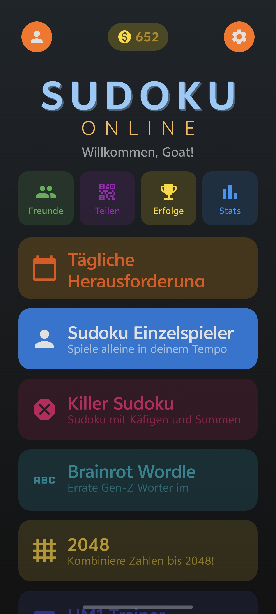
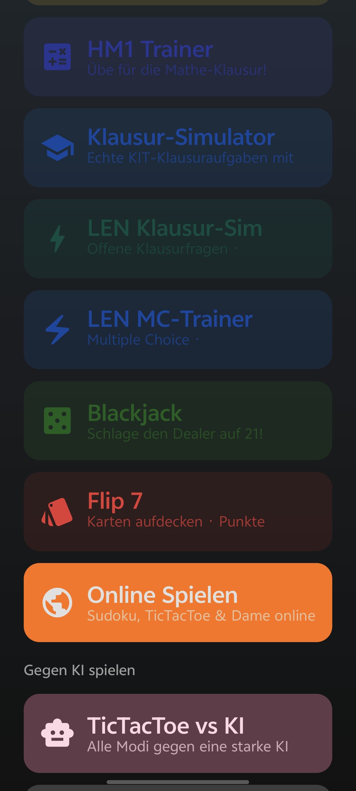
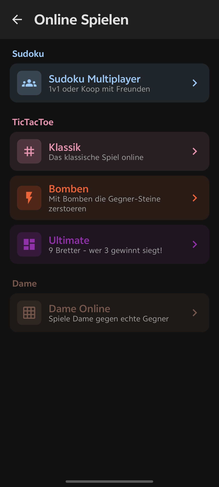
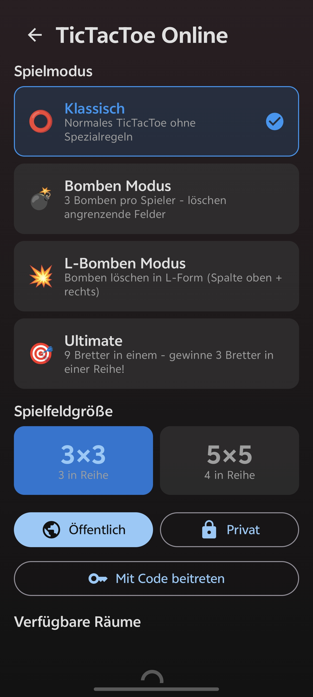

# Sudoku Online

**A multiplayer puzzle and board game platform for Android.**

Real-time online matches, ranked leagues, AI opponents, daily challenges, and an in-game economy — all in one app. Built with Jetpack Compose and Firebase Realtime Database.

[](https://outblade.github.io/sudoku-online-download/)
[](https://github.com/OutBlade/SudukoOnline/releases/latest)
[](https://outblade.github.io/sudoku-online-download/)

---

## Games

**Sudoku** — Classic 9x9 and Killer Sudoku. Four difficulty tiers: Easy, Medium, Hard, Expert. Cooperative and competitive multiplayer modes.

**TicTacToe** — Three board sizes (3x3, 5x5, 7x7), Bomb Mode, and Ultimate TicTacToe. Online or against a minimax AI with opening book and transposition table.

**Dame (Checkers)** — Full checkers rules with forced captures and king promotion. Online or against AI.

**Muhle (Nine Men's Morris)** — Endgame-accurate AI with perfect play in 3-piece scenarios.

---

## Online Play

All games use Firebase Realtime Database for sub-second state sync. Players join via six-character room codes or public matchmaking.

- Private rooms with shareable codes
- Public matchmaking queue with difficulty and mode filtering
- Real-time opponent progress tracking
- Cooperative and competitive Sudoku modes
- Automatic room cleanup on disconnect

---

## Features

- League system with seven ranks and seasonal leaderboards
- Friends list with in-app challenges and activity feed
- Daily challenges with rotating puzzle seeds
- Daily login bonus and lootbox rewards
- In-game coin economy with a theme shop
- 50+ achievements with cross-session persistence
- Detailed statistics dashboard per game type
- Puzzle editor for custom Sudoku layouts
- Intelligent hint system with ad-based bonus hints
- Offline single-player with auto-save and resume

---

## Screenshots

<p align="center">
  
  
  
  
</p>

---

## Architecture

| Layer | Technology |
|---|---|
| UI | Jetpack Compose, Material Design 3 |
| State | ViewModel + StateFlow |
| Backend | Firebase Realtime Database, Firebase Auth |
| Local storage | Room (SQLite) |
| Build | Gradle with Kotlin DSL, KSP |
| Min SDK | Android 8.0 (API 26) |
| Target SDK | Android 15 (API 35) |

---

## Project Structure

```
app/src/main/java/de/sudokuonline/app/
  data/
    model/          Data classes — GameRoom, Player, SudokuBoard, TicTacToe/Dame/Muhle models
    repository/     Firebase repositories — Game, TicTacToe, Dame, Auth, Friends, Leaderboard
    local/          Room database — game history, AI position cache
  game/
    SudokuGenerator.kt        Backtracking puzzle generator with difficulty control
    SudokuSolver.kt           Constraint propagation solver
    SudokuValidator.kt        Move validation and completion checks
    KillerSudokuGenerator.kt
    TicTacToeLogic.kt / DameLogic.kt / MuhleLogic.kt
    ai/
      AIEngine.kt             Minimax with alpha-beta pruning
      TranspositionTable.kt   Zobrist-hashed move cache
      ThreatSpaceSearch.kt    Threat-based pruning for TicTacToe
      OpeningBook.kt          Precomputed opening positions
      MuhleEndgame.kt         Perfect endgame solver
  ui/
    screens/        40+ Compose screens
    components/     Reusable Compose components
    theme/          Material 3 color tokens and typography
  viewmodel/        One ViewModel per screen, scoped to lifecycle
  navigation/       Single NavGraph with deep link support
```

---

## Building

Requires Android SDK, JDK 17, and a Firebase project.

```bash
# Clone
git clone https://github.com/OutBlade/SudukoOnline.git
cd SudukoOnline

# Debug build
./gradlew assembleDebug

# Signed release build (uses env vars in CI, local keystore fallback)
KEYSTORE_FILE=path/to/release.jks \
KEYSTORE_PASSWORD=... \
KEY_ALIAS=... \
KEY_PASSWORD=... \
./gradlew assembleRelease
```

Place your `google-services.json` in `app/` before building.

---

## CI / CD

A GitHub Actions workflow builds and signs the release APK on every push to `main` and automatically deploys it to the [download page](https://outblade.github.io/sudoku-online-download/).

Required repository secrets:

| Secret | Description |
|---|---|
| `KEYSTORE_BASE64` | Release keystore encoded as base64 |
| `KEYSTORE_PASSWORD` | Keystore password |
| `KEY_ALIAS` | Key alias |
| `KEY_PASSWORD` | Key password |
| `DEPLOY_TOKEN` | GitHub PAT with repo scope for the download page repository |

---

## Firebase Setup

1. Create a project at [console.firebase.google.com](https://console.firebase.google.com)
2. Add an Android app with package name `de.sudokuonline.app`
3. Download `google-services.json` and place it in `app/`
4. Enable Realtime Database in the Europe West region
5. Deploy the included database rules:

```bash
firebase deploy --only database
```

The `firebase-database-rules.json` at the project root contains the required security rules and field indexes for all queries.

---

## License

MIT
